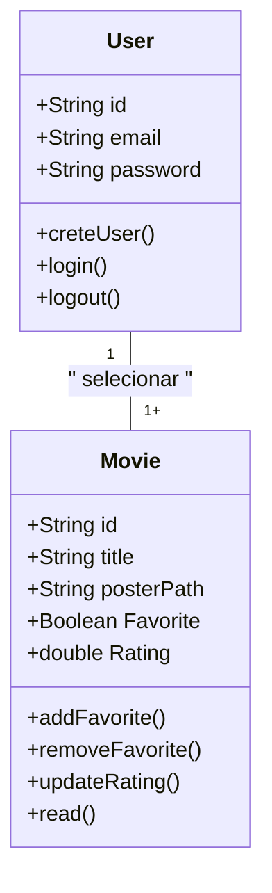

# CineFavorite - Formativa

Construindo um aplicativo do Zero - O CineFavorite permitirá criar uma conta e buscar filmes em uma api e montar uma galeria pessoal de filmes favoritos, com capas e notas.

## Objetivos

- Integrar o Aplicativo a uma API
- Criar uma conta pessoal no FireBase
- Armazenar informações para Cada usuários das preferencias solicitadas
- Consultar informações de Filmes (Capas, Título)

## Levantamentos de Requisitos

- Funcionais

- Não Funcionais

## Diagramas

1. ### Diagrama de Classe

   Diagrama que demonstra as entidades da aplicação

   - Usuário (user) : classe criada pelo FireBase

     - email
     - senha
     - id
     - create()
     - login()
     - logout()

   - Filme (Movie) : Clase modelada pelo dev
     - number id:
     - String titulo:
     - String PosterPath
     - boolean favorito
     - double Nota
     - adicionar()
     - update()
     - remover()
     - listarFavoritos()



2. ### Diagrama de Uso

```mermaid

usecase
    (Criar Conta) --> (User)
    (Login) --> (User)
    (Logout) --> (User)

    (Buscar Filmes) --> (Movie)
    (Selecionar Filme) --> (Movie)
    (Adicionar aos Favoritos) --> (Movie)
    (Remover dos Favoritos) --> (Movie)
    (Atualizar Nota) --> (Movie)
    (Visualizar Lista de Favoritos) --> (Movie)

```

3. ### Diagrama de Fluxo

## Prototipagem

- Colocar o Link do Figma

## Codificação
