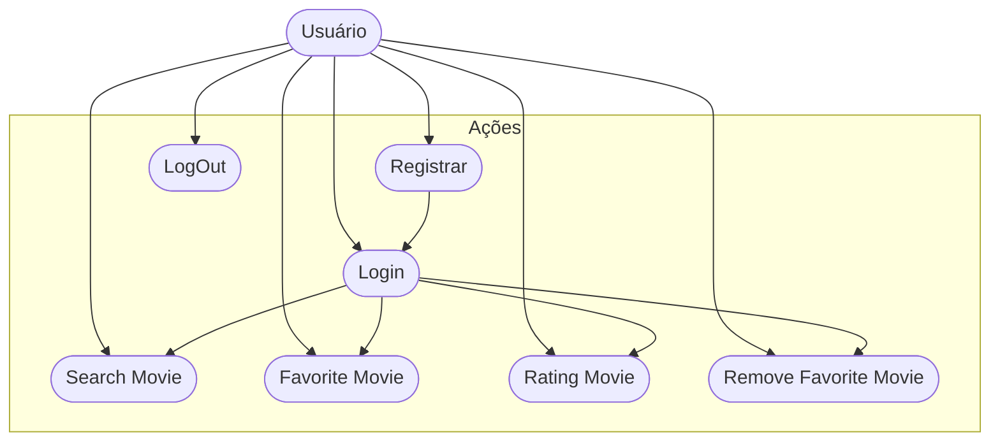

# CineFavorite - Formativa

Construindo um aplicativo do Zero - O CineFavorite permitirá criar uma conta e buscar filmes em uma api e montar uma galeria pessoal de filmes favoritos, com capas e notas.

## Objetivos

- Integrar o Aplicativo a uma API
- Criar uma conta pessoal no FireBase
- Armazenar informações para Cada usuários das preferencias solicitadas
- Consultar informações de Filmes (Capas, Título)

## Levantamentos de Requisitos

- Funcionais

- Não Funcionais

## Diagramas

1. ### Diagrama de Classe

   Diagrama que demonstra as entidades da aplicação

   - Usuário (user) : classe criada pelo FireBase

     - email
     - senha
     - id
     - create()
     - login()
     - logout()

   - Filme (Movie) : Clase modelada pelo dev
     - number id:
     - String titulo:
     - String PosterPath
     - boolean favorito
     - double Nota
     - adicionar()
     - update()
     - remover()
     - listarFavoritos()


2. ### Diagrama de Uso

- Usuário (User)
  - Registrar
  - Login
  - Logout
  - Buscar Filmes na API
  - Adicionar aos Favorito
  - Dar Nota ao Filme
  - Remover dos Favoritos



3. ### Diagrama de Fluxo
Determina o Caminho que um ator percorre para realizar uma ação

- Ação de Login

```mermaid

A[Ínicio] --> B{Tela de login}
B --> C[Inserir email e senha]
C --> D{Validar as Credenciais do Usuário}
D --> SIM --> E[Tela de Favoritos]
D --> NÃO --> F[Mensagem de Erro] --> E

```

## Prototipagem

- Colocar o Link do Figma

- https://www.figma.com/design/jhqKIMBzJvGmzulnyGcaoj/Untitled?node-id=0-1&t=CRLzXkYuQTSjA14l-1

## Codificação
